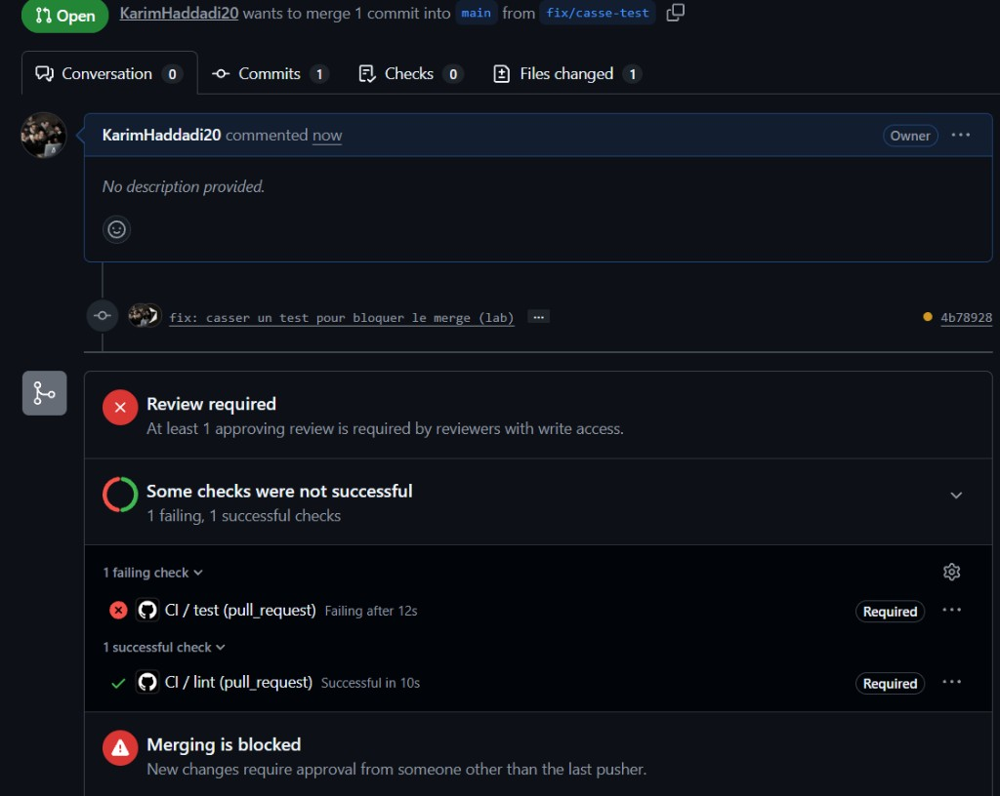

# TaskFlow — dépôt fil rouge CI/CD

[](https://github.com/KarimHaddadi20/cicd-fil-rouge/actions/workflows/ci.yml)

TaskFlow est une petite API de gestion de tâches écrite en Python avec FastAPI.
C'est le projet fil rouge du module CI/CD (Mastère DevOps M1, Sup de Vinci) :
pendant trois jours, vous allez construire autour d'elle un pipeline complet
qui teste, construit, sécurise et livre l'application.

## Lancer l'API en local

Prérequis : Python 3.10 ou plus récent.

```bash
python3 -m venv .venv
source .venv/bin/activate          # Windows : .venv\Scripts\activate
pip install -r requirements-dev.txt
uvicorn app.main:app --reload
```

L'API répond sur http://localhost:8000 et sa documentation interactive est sur
http://localhost:8000/docs.

## Vérifier le code

```bash
pytest           # tests automatiques
ruff check .     # lint
ruff format .    # mise en forme
```

## Lancer avec Docker

```bash
docker build -t taskflow .
docker run --rm -p 8000:8000 taskflow
```

## Endpoints

| Méthode | Chemin | Rôle |
| --- | --- | --- |
| GET | `/health` | État de l'API et version |
| GET | `/tasks` | Liste des tâches |
| GET | `/tasks/search?q=...` | Recherche dans les titres |
| POST | `/tasks` | Crée une tâche (`{"title": "..."}`) |
| GET | `/tasks/{id}` | Détail d'une tâche |
| PATCH | `/tasks/{id}/done` | Marque une tâche comme faite |
| DELETE | `/tasks/{id}` | Supprime une tâche (en-tête `X-API-Token` requis) |

## Configuration

| Variable | Rôle | Défaut |
| --- | --- | --- |
| `APP_VERSION` | Version affichée par `/health` | `0.1.0` |
| `DB_PATH` | Fichier SQLite | `taskflow.db` |
| `API_TOKEN` | Jeton exigé pour supprimer une tâche | vide (suppression désactivée) |
| `NOTIFY_WEBHOOK_URL` | Webhook appelé à chaque création de tâche | vide (désactivé) |

## Équipe

- Karim Haddadi ([@KarimHaddadi20](https://github.com/KarimHaddadi20))
- Amine ([@Amine92-cpu](https://github.com/Amine92-cpu))

## Gouvernance du dépôt

Ruleset GitHub **Protection main**, ciblant `main`, enforcement `active`, sans bypass.

| Règle | Pourquoi |
| --- | --- |
| Pull request obligatoire | Aucun commit n'atteint `main` sans revue : on ne peut pas y glisser un workflow en push direct. |
| 1 approbation | Le binôme doit relire avant le merge ; l'auteur ne peut pas s'auto-approuver. |
| Require review from Code Owners | Une modification de `.github/workflows/` doit être approuvée par un propriétaire déclaré dans `CODEOWNERS`. |
| Force push interdit | Empêche de réécrire l'historique (et de masquer un changement de pipeline). |
| Suppression de branche interdite | Empêche d'effacer `main`. |

`CODEOWNERS` limite la revue obligatoire aux workflows :

```
/.github/workflows/ @KarimHaddadi20 @Amine92-cpu
```

### Capture du push direct refusé

Tentative : `git push origin main` après le ruleset.

```
(à capturer après activation du ruleset)
```

## Pipeline CI

Le workflow `.github/workflows/ci.yml` s'exécute à chaque pull request (et sur `main`).

| Job | Rôle |
| --- | --- |
| `lint` | `ruff check .` — style, imports, erreurs Python (E, F, W, I). Cache pip. |
| `test` | `pytest` sur une **matrice** Python 3.11 / 3.12 / 3.13. Rapport JUnit en artefact. |
| `CI OK` | Job sentinelle : il ne passe que si `lint` **et** tous les `test` de la matrice sont verts. |

`concurrency` annule un run précédent sur la même branche dès qu'un nouveau push arrive.

### Pourquoi la PR est verte mais bloquée

Le ruleset exigeait les checks nommés `lint` et `test`. Avec la matrice, GitHub publie `test (3.11)`, `test (3.12)`, `test (3.13)` : le check `test` n'existe plus. Tout est vert, le merge reste bloqué.

**CI OK** est le seul check obligatoire dans le ruleset : son nom ne change pas quand on ajoute une version Python. C'est lui qui agrège lint + matrice ; si un job est rouge, CI OK est rouge et le merge reste interdit.

### Durée d'installation pip (cache)

À noter dans l'onglet Actions, étape « Installer les dépendances » :

| Run | Cache | Durée pip install |
| --- | --- | --- |
| Premier run (`test` 3.11, `Downloading …`) | miss | **6 s** |
| Re-run (`test` 3.11, `Using cached …`) | hit | **3 s** |

Le cache pip divise le temps d'installation par deux (6 s → 3 s) sur le même job.

L'artefact `test-report-3.12` (et les autres versions) se télécharge depuis le run Actions → Artifacts.

### Capture de la PR bloquée

PR `fix/casse-test` → `main` : le test `/health` a été cassé volontairement (`status == "ko"`).

- `CI / lint` : vert (Required)
- `CI / test` : rouge (Required) — *Failing after 12s*
- **Merging is blocked**



```
Some checks were not successful
1 failing, 1 successful checks

× CI / test (pull_request)   Failing after 12s   Required
✓ CI / lint (pull_request)   Successful in 10s   Required

Merging is blocked
```

